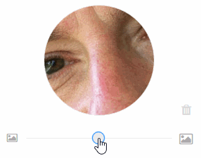
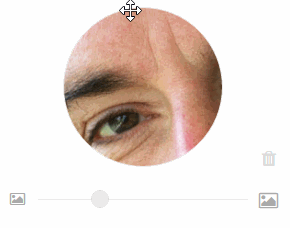
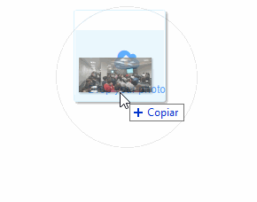

# Profile picture

[Demo version](http://www.dsalvagni.com.br/profile-picture) | [Codepen](http://codepen.io/dsalvagni/pen/BLapab)

## Screenshots
 


## Getting started
Import the `profile-picture.js` and `profile-picture.css` to your project, then use the `html` template from the `index.html` file.

```
var pp = profilePicture(cssSelector, imageUrl?, options?);
```

## Model
```javascript
{
    imageSrc,
    width,
    height,
    originalWidth,
    originalHeight,
    top,
    left,
    scale
}
```

## Options

### Slider options

#### initialValue
> Slider's handler initial position

#### minValue
> When the slider's handles is on its minimum position

#### maxValue
> When the slider's handles is on its maximum position

### Image options

#### minWidth
> Set the minimum image's width size acceptable

#### minHeight
> Set the minimum image's height size acceptable

#### originalWidth
> Define the original image's width

#### originalHeight
> Define the original image's height

#### originalLeft
> Define the original image's left offset

#### originalTop
> Define the original image's top offset


## Callbacks

### onLoad
> When the image is loaded, this callback is called with the **model** as parameter.

### onChange
> When anything changed, this callback is called with the **model** as parameter.

### onRemove
> When the image is remove, this callback is called with an empty **model** as parameter.

### onSliderChange
> When you drag the slider handler/zooming, this callback is called with the **model** as parameter.

### onPositionChange
> When you drag the image, this callback is called with the **model** as parameter.

### onError
> When something wrong happens, this callback is called with the **error type** as parameter.

| Error type   | Description |
|---|---|
| image-size   | The image is too small  |
| file-type   | The file isn't a image  |
| unknown | Errors didn't mapped |


## Methods

### getData
```
    /* Returns the model */
    pp.getData();
```

## Dependencies
[jQuery](https://jquery.com/) and [FontAwesome*](http://fontawesome.io/)
*You can use other icon gallery as well.

## Known issues
- In older versions of Microsoft Edge the "drop files" feature doesn't work as expected.
  [Bug link](https://connect.microsoft.com/IE/feedback/details/1544800/ms-edge-drop-files-from-explorer-to-browser-does-not-work-as-expected)

## Browser support
IE10+ | Chrome | Firefox | Safari
